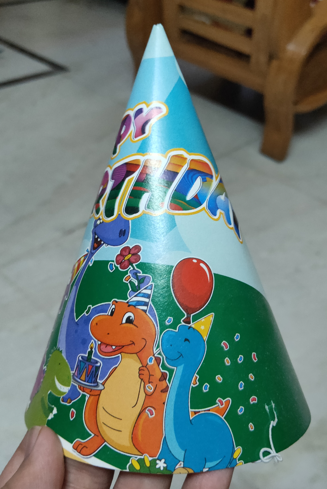

# Slit Scanning using PIL & ffmpeg
This script does a basic attempt at reproducing the slit scan effects. 

Heavily inspired by slit scan photos and [William Osman's video](https://www.youtube.com/watch?v=nZM9Ko806Bg), this script processes a 1080p - 60fps - Horizontal video of a rotating subject, extracts the middle vertical strip of pixels and appends each such strip to form an image.

The performance can be improved by stabilizing the subject and the camera as well as ensuring a constant speed of rotation.

## Requirements:
- **Python Image Library installed** (`pip install pillow`)
- **Video should be shot in 1080p - 60 fps - Landscape mode**
- `ffmpeg.exe` (Provided in repo)
- Video should be apprx. 10 - 15 seconds long

## Instructions:
- Clone the repo or download the zip.
- Extract the zip (if not cloned).
- Place your **1080p - 60fps - Landscape mode** video into the `video` folder
- Run `Leatherface.exe` to execute the script
- The result image should become available in the `result` folder.
- Stabilizing the video should improve the result.

## Example:

    
     
    <em>Test Object</em>

    
     
    <em>Result (Can be improved by stabilizing)</em>

